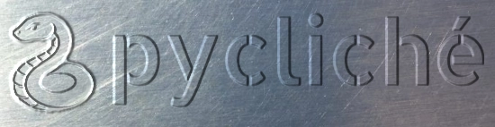

<!-- markdownlint-disable MD041 first-line-heading/first-line-h1 -->

<!-- markdownlint-disable MD033 no-inline-html -->
<p align="center">
  <!-- markdownlint-disable MD013 line-length -->
  
  <!-- markdownlint-enable MD013 line-length -->
</p>

`pycliche` - a Python project template with opinionated tooling.

[](https://docs.python.org/3.10/whatsnew/3.10.html)
[](https://github.com/copier-org/copier)
[](https://github.com/casey/just)
[](https://github.com/astral-sh/uv)
[](https://github.com/pre-commit/pre-commit)
[](https://github.com/astral-sh/ruff)
[](https://ipython.readthedocs.io/en/stable/)
[](https://github.com/hynek/structlog)
[](https://github.com/pytest-dev/pytest)
[](https://coverage.readthedocs.io/)
[](https://github.com/PyCQA/bandit)
[](https://github.com/googleapis/release-please)
[](https://github.com/albertomh/pycliche/actions/workflows/ci.yaml)

Projects created using `pycliche` include:

- A basic Python package and entrypoint, configured via a `pyproject.toml`.
- Dependencies managed via `uv`, using a `uv.lock` file for consistent and reproducible builds.
- IPython as the default shell.
- Simple configuration to enhance your logs with `structlog`.
- Scaffolding for unit tests run via `pytest`.
- Out-of-the-box code coverage reporting with `coverage.py`.
- Batteries-included `pre-commit` hook configuration to lint & format code, and run SAST.
- A `justfile` to enable using `just` as a task runner.

Optionally, for projects intended to be hosted on GitHub, also include:

- GitHub Actions to:
  - Automate cutting releases via `Release Please`.
  - Run `pre-commit` hooks and `pytest` as part of a Continuous Integration pipeline.
- A `dependabot` configuration to keep Python packages & GitHub Actions up to date.

<p align="center">
  <!-- markdownlint-disable MD013 line-length -->
  
  <!-- markdownlint-enable MD013 line-length -->
</p>

## Prerequisites

To use `pycliche` the following must be available locally:

- [Python 3.10](https://docs.python.org/3.10/) or above
- [uv](https://docs.astral.sh/uv/)

## Bootstrap a new Python project

Bootstrap a new Python project using `pycliche`:

1. Navigate to the directory under which you wish to create a new project.
1. Run `uvx copier copy --trust gh:albertomh/pycliche <project_name>` and follow the wizard.

This creates a directory under your current location. Follow the README in the new directory
to get started with your project.

Please note:

- it is not necessary to clone `pycliche`. The `gh:albertomh/pycliche` argument will pull
  the latest tag from GitHub.
- the `--trust` flag is necessary since a post-creation task initialises the new directory
  as a git repository and generates a `uv` lockfile.

## Update existing projects

To update a project created using an older version of `pycliche` to a newer version of the
template:

```sh
cd ~/Projects/existing_project/
uvx copier update --skip-answered --trust [--vcs-ref=<TAG>]
```

If the `--vcs-ref` flag is not specified `copier` will use the latest `pycliche` tag.

---

## Develop

The developer README ([docs/README-dev.md](docs/README-dev.md)) covers how to work on
`pycliche` itself. It covers:

- [Develop](docs/README-dev.md#develop)
  - [Development prerequisites](docs/README-dev.md#development-prerequisites)
  - [Recursive pycliche](docs/README-dev.md#recursive-pycliche)
  - [Git principles](docs/README-dev.md#git-principles)
  - [Dependency management](docs/README-dev.md#dependency-management)
    - [Updating dependencies in the template](docs/README-dev.md#updating-dependencies-in-the-template)
  - [Generate project using development version](docs/README-dev.md#generate-project-using-development-version)
  - [Style](docs/README-dev.md#style)

- [Test](docs/README-dev.md#test)

- [Release](docs/README-dev.md#release)
  - [GitHub Personal Access Token](docs/README-dev.md#github-personal-access-token)

- [Record demo](docs/README-dev.md#record-demo)

---

## Acknowledgements

Several tooling choices have been guided by the work of [Adam Johnson](https://adamj.eu/tech/).

The `pycliche` logo is typeset in [Allerta Stencil](https://fonts.google.com/specimen/Allerta+Stencil).
